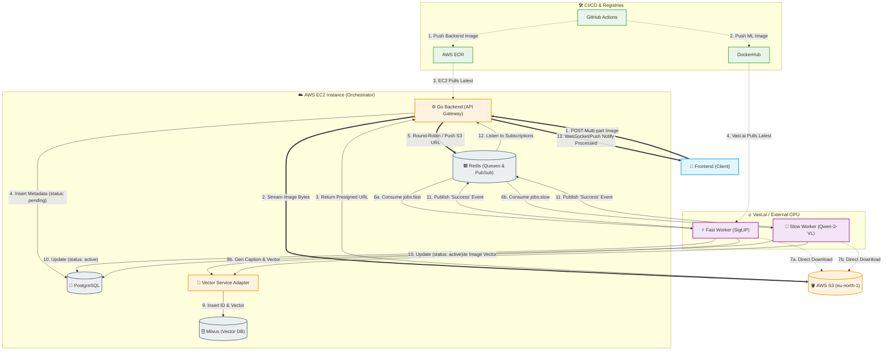
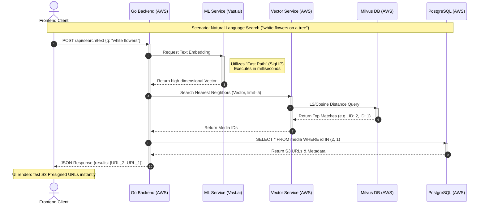

<<<<<<< HEAD
# AI Photo Retrieval System

A semantic photo retrieval system that lets you search your library using natural language or example images. Powered by CLIP, Milvus, and Go.

## Key Features
- **Semantic Search**: Search by meaning (e.g., "birthday party", "sunset") or image similarity using CLIP embeddings.
- **Smart Upload**: Multi-file upload with automatic duplicate detection and EXIF metadata extraction.
- **Cross-Platform**: Responsive Flutter client for Desktop and Mobile.
- **Scalable Architecture**: Modular Go backend with Python microservices for ML and Vector search.

## Tech Stack
- **Backend**: Go (Gin), PostgreSQL, Redis, SeaweedFS
- **ML & Search**: Python (FastAPI), OpenAI CLIP, Milvus Vector DB
- **Frontend**: Flutter

## Quick Start

### Prerequisites
- Docker & Docker Compose
- Flutter SDK (for running the client)

### Run the System
```bash
# Start all backend services
docker-compose up -d

# Check service health
curl http://localhost:8080/healthz
```

### Run the Client
```bash
cd frontend_flutter
flutter pub get
flutter run
```

## Fine-Tuning Achievements
We fine-tuned the CLIP ViT-B/32 model on social event classification using LoRA (Low-Rank Adaptation).
- **Baseline Accuracy**: 83.21%
- **Fine-Tuned Accuracy**: **91.56%** (+8.35% improvement)
=======
# AI-Powered Photo Retrieval System

A high-performance, distributed system designed for natural language and visual similarity photo searching. This project leverages a multi-cloud architecture, decoupling heavy Machine Learning inference from the API gateway to ensure scalability and responsiveness.

## 🏗️ System Architecture

The system is composed of four primary service layers communicating through a combination of RESTful APIs and asynchronous message queues.

### Core Services
* **Go Backend (API Gateway & Producer):** The "Brain" of the system. Handles multi-part uploads, metadata extraction, S3 orchestration, and fair-share job scheduling.
* **ML Service (GPU Inference):** A Python-based service running on high-end GPUs (e.g., NVIDIA RTX 4090).
    * **SigLIP:** Provides high-speed, baseline text-and-image embeddings.
    * **Qwen-2-VL:** A Vision-Language Model used for deep semantic captioning and complex visual reasoning.
* **Vector Service:** A specialized adapter for **Milvus**, managing high-dimensional vector indexing and similarity searches.
* **Infrastructure Layer:** * **PostgreSQL:** Stores image metadata and processing states.
    * **Redis:** Acts as the message broker for task queues and real-time status updates.
    * **AWS S3:** Persistent object storage for original images and thumbnails.

---

## 🚀 Execution Pipelines

### 1. Storage Pipeline (The "Ingest" Flow)
This pipeline ensures that a photo is safely stored and indexed without blocking the user.

1.  **Frontend:** User uploads a photo via the Flutter/Mobile client.
2.  **Go Backend:** Extracts EXIF metadata and generates a unique checksum for deduplication.
3.  **AWS S3:** Backend streams the image to S3; S3 returns a persistent URL.
4.  **PostgreSQL:** Backend records the image metadata and sets the status to `pending`.
5.  **Redis (Producer):** The Backend performs **User-Based Round Robin** scheduling to ensure fairness. It then pushes the S3 URL to two queues: `jobs:fast` and `jobs:slow`.
6.  **Worker (Consumer):**
    * **Fast Path:** Picks the job from `jobs:fast`, calls the ML Service's **SigLIP** endpoint.
    * **Slow Path:** Picks the job from `jobs:slow`, calls the ML Service's **Qwen** endpoint (triggering model load if necessary).
7.  **ML Service:** Downloads the image directly from S3 (bypassing the backend to save bandwidth) and generates embeddings/captions.
8.  **Vector Service:** Receives the generated vectors and inserts them into the **Milvus** collection.
9.  **PostgreSQL (Update):** Worker updates the record to `active` once both embeddings are indexed.
10. **Redis (Pub/Sub):** Worker publishes a "Success" message; the Backend can then notify the Frontend via WebSockets or long-polling.

### 2. Retrieval Pipeline (The "Search" Flow)
1.  **Frontend:** Sends a natural language query (e.g., *"white flowers on a tree"*) or a query image.
2.  **Go Backend:** Routes the query to the ML Service.
3.  **ML Service:** Encodes the query into a high-dimensional vector.
4.  **Vector Service:** Queries Milvus using the vector to find the top-$k$ nearest neighbors.
5.  **Go Backend:** Fetches the corresponding S3 URLs and metadata from PostgreSQL for the returned IDs.
6.  **Frontend:** Displays the results to the user with low-latency S3 Presigned URLs.

---

## 🧠 Architectural Feats

### ⚖️ Fair-Share & Priority Scheduling
To prevent a single user from overwhelming the GPU with thousands of uploads, the Go Backend implements a **Round-Robin Producer**. It organizes tasks into per-user buckets before injection into Redis. Furthermore, the workers implement a **Priority Queue** logic: the `jobs:fast` (SigLIP) queue is prioritized over `jobs:slow` (Qwen), ensuring that basic search functionality is available to the user within seconds, while deeper AI analysis completes in the background.

### ☁️ Cloud-Agnostic / "Plug & Play" ML
The system is designed with an environment-agnostic strategy. By passing **S3 URLs** instead of raw byte streams between services, we eliminate the network bottleneck. This allows the **ML Service** to be hosted anywhere (Vast.ai, RunPod, or a local GPU rig) without reconfiguring the core API. 

### ⚡ Direct S3 Ingress
Unlike traditional architectures where the backend acts as a middleman for all data, our ML workers pull directly from S3. This significantly reduces the load on the AWS EC2 instance and prevents "Double-Hopping" data across the internet.

---

## 🔄 CI/CD & Deployment

We utilize **GitHub Actions** for automated testing and deployment:

* **Go & Vector Services:** Upon a `push`, GitHub Actions builds Docker images and pushes them to **AWS Elastic Container Registry (ECR)**. The EC2 instance then pulls and restarts the containers via Docker Compose.
* **ML Service:** Pushes to **DockerHub**. This allows the ML Host (Vast.ai) to automatically pull the latest `ml_service:latest` image upon deployment, enabling a seamless "Plug and Play" transition between GPU providers.

---

## 🛠️ Tech Stack summary
| Service | Technology |
| :--- | :--- |
| **Language** | Go (Backend), Python (ML) |
| **Database** | PostgreSQL, Milvus (Vector), Redis (Cache/Queue) |
| **Storage** | AWS S3 |
| **ML Models** | SigLIP (Fast), Qwen-2-VL (Slow/Semantic) |
| **Containerization** | Docker, Docker Compose |
| **Deployment** | AWS EC2 (API), Vast.ai (GPU), ECR/DockerHub (Registry) |

---
*Developed as a Senior Project, 2026.*

## Flowchart: The Storage / CI/CD Pipeline (Ingestion)



## Flowchart: The Retrieval Pipeline (Search)


>>>>>>> aa3763fa7b72ca20a66743a7e808d3e539d2d5d1
